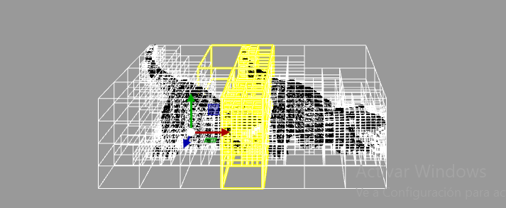
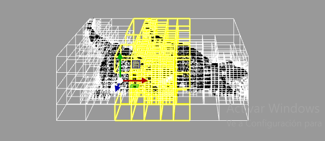
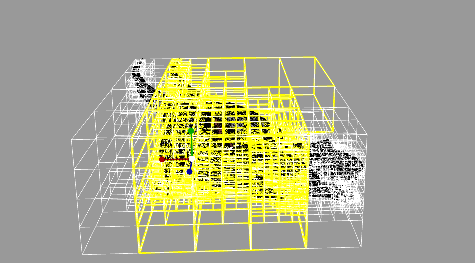
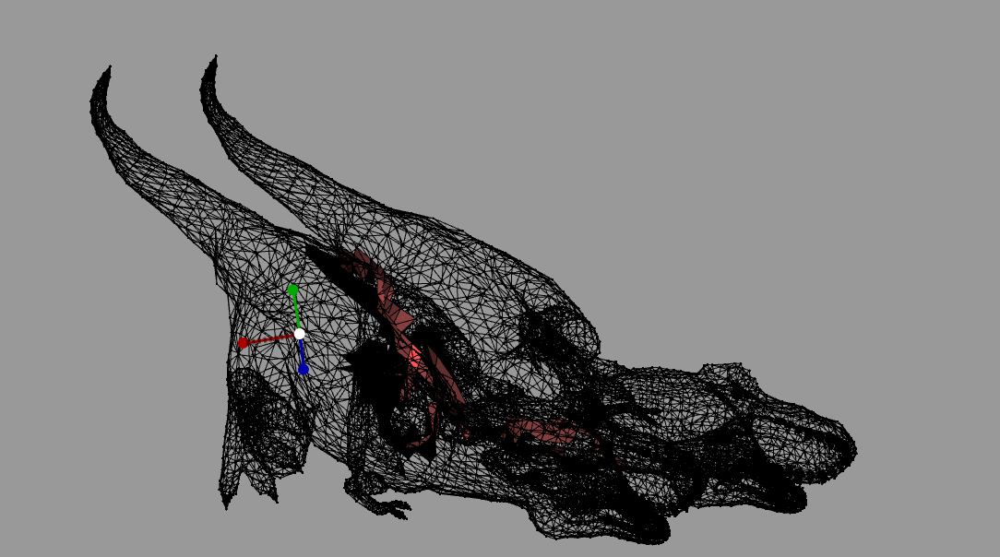
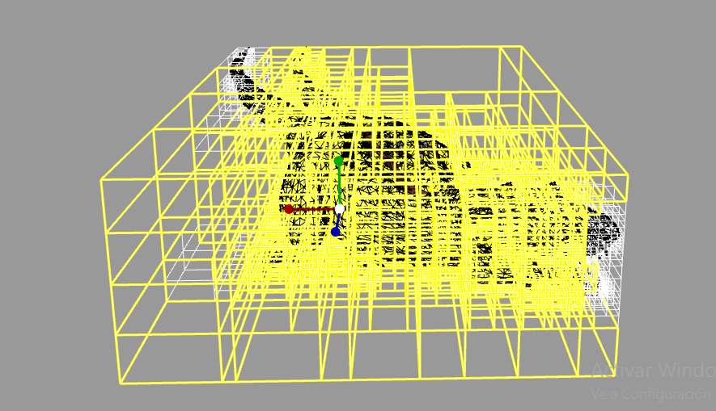
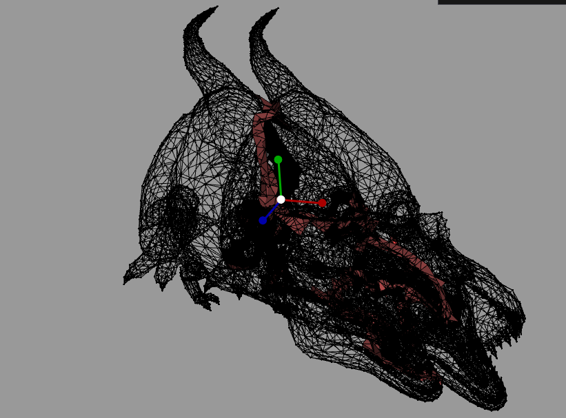

# Comparativa de Rendimiento: Octree vs Fuerza Bruta

Esta tabla resume los resultados de las pruebas de colisión realizadas, comparando la eficiencia del algoritmo basado en Octree frente al método de fuerza bruta.

| Ejecución | Detalles Octree (Cajas / Triángulos / Tiempo) | Fuerza Bruta (Tiempo / Nº operaciones) | Visualización de Colisiones (Cajas) | Visualización de Colisiones (Triángulos) |
| :--- | :--- |:---------------------------------------| :--- | :--- |
| **1ª Ejecución** | 2024 cajas 0 triángulos **0.142594s** | 40.73s 142.515.844                  |  | - |
| **2ª Ejecución** | 2688 cajas 0 triángulos **0.543877s** | 40.7965s                               |  | - |
| **3ª Ejecución** | 4027 cajas 549 triángulos **2.06602s** | 41.263s                                |  |  |
| **4ª Ejecución** | 5067 cajas 1582 triángulos **4.51807s** | 41.364s                                | |  |

## Notas de los resultados
- **Eficiencia**: El Octree reduce drásticamente el tiempo de ejecución (de ~40s a <5s incluso en casos complejos).
- **Visualización**: En las dos primeras ejecuciones no se detectaron colisiones de triángulos (0 triángulos), por lo que solo se muestran las cajas involucradas en la aproximación. En las dos últimas, se incluyen tanto las cajas del Octree como los triángulos específicos que intersectan.
